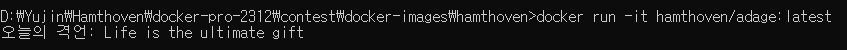

# 한 줄 격언

## 소개

영어로 된 격언을 안내해줍니다.

## 실행

1. CMD에서 폴더 접근 후 빌드

```python
docker build --tag hamthoven/adage:latest .
```

2. 컨테이너 실행

```python
docker run -it hamthoven/adage:latest
```

3. 짜잔! (결과가 나왔다!)


## 질문과 참고 자료

- `chmod +x`가 뭐지? 

    - 실행 권한을 부여해 주는 것 
    - [[Linux] chmod +x 리눅 권한설정 명령어](https://kimkyunghwan-jinjinghuan.tistory.com/356)

- `ENTRYPOINT`... 잘 모르겠다.
    - 실행 명령어인데 항상 실행되어야 하는 커맨드를 지정할 수 있음
    - [RUN, CMD, ENTRYPOINT 명령어의 개념과 차이점](https://choco-life.tistory.com/49)
    - [Dockerfile Entrypoint 와 CMD의 올바른 사용 방법](https://bluese05.tistory.com/77)

## 오류 상황 대처

- 오류 안내를 포함한 run 결과

```Docker 
# 상략
ERROR: failed to solve: dockerfile parse error on line 1: FROM requires either one or three arguments

[+] Building 23.1s (11/11) FINISHED
#하략
```
이 상황에서 오류 내용이 이해가 안되기도 하고 실행하면 어느 부분인지 콕 찝어주리라는 믿음으로 run을 실행하니 다음과 같은 결과 도출

```Docker 
# 상략
Traceback (most recent call last):
  File "/app/adage.py", line 1, in <module>
    import requests
ModuleNotFoundError: No module named 'requests'
#하략
```

'위의 오류가 나더니 이것 때문일수도?'라는 생각으로 일단 이 문제부터 해결 시작!

안내가 친절하게도 첫 줄이 어떤 내용인지도 알려주고 무슨 문제인지도 알려주었기에 대처 방안을 알아내는 건 쉬웠다.

`import requests`를 위해 사전 설치가 필요한데 Docker 환경에는 되어있지 않았기 때문... 일 수 밖에 없었다. 

그래서 Dockerfile에 다음 문장을 추가

```Docker
RUN pip install requests
```
Dockerfile에 변경사항이 있기 때문에 다시 build한 결과

```Docker 
# 상략
[+] Building 4.7s (12/12) FINISHED
#하략
```

오류였을 하나에 대한 이야기가 없어지고 제대로 설치 완료!

이후 run 명령어에도 성공적으로 결과가 도출되었다.

## 실험

- 질문: Dockfile은 그대로인 채 python 파일을 바꾸면 어떻게 될까?

- 예상: 환경에 관한 거니까 바뀌지 않을까?

그래서 adage.py 파일을 다음과 같이 변경해서 run만 해보았다. 원래는 "오늘의 격언: ~ "이었다.

```python
print(f"당신을 위한 격언: {quote}")
```

- 결론: 변경이 안된다! Dockerfile은 환경에 관한 것만 다룬다고 생각해서 바뀔 줄 알았는데 아니었다... 이건 조금 더 알아봐야 할 것 같다.


## 여담

- 분명 격언 API인 줄 알았는데 출력하다 보니 격언만 있는 건 아닌 거 같다.
- 오류 해결법을 바로 추측해낸 이유 중 하나는 다른 사람들은 어떻게 했나 8월 콘테스트 구경하다가 어떤 분이 Dockerfile에 `RUN pip install` 구문을 쓰셨었다. 

요약: 다른 사람들의 콘테스트 참가 내용은 완전 유용한 참고자료다! 오류가 난다면 참고해보자!