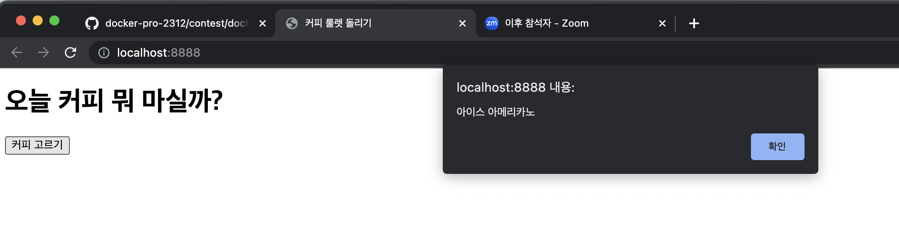

# 오늘 커피 뭐 마실까?

현재 날씨에 따라서 핫/아이스 아메리카노 또는 카페라떼를 골라주는 앱

## [Openweather API](https://openweathermap.org/)

현재 날씨 정보를 불러오는 API 제공

## 실행 방법

### Docker hub에서 Pull

```
docker pull yunnn426/todays-coffee
```

### Run

```
docker run -p 8888:80 yunnn426/todays-coffee
```

### localhost:8888 접속

```
http://localhost:8888/
```

### 실행


