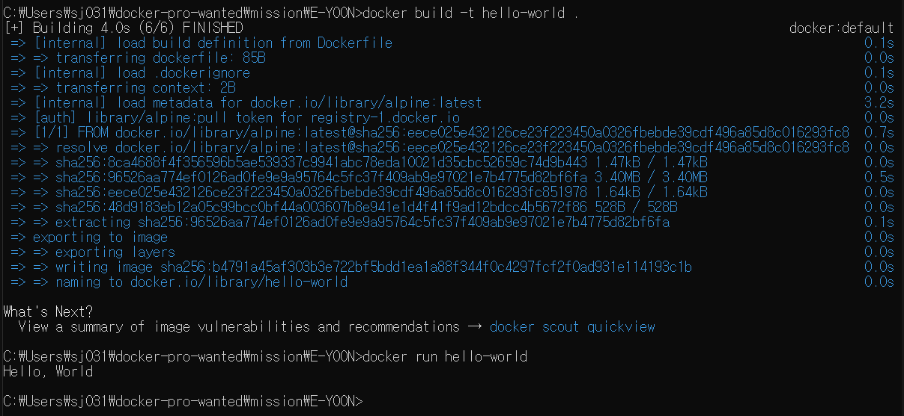

### 1. 컨테이너 기술이란 무엇입니까?
컨테이너는 애플리케이션과 그에 필요한 모든 종속성(라이브러리, 환경변수 등)을 포함하는 런타임 환경을 구축하는 기술이다.

### 2. 도커란 무엇입니까?
도커는 리눅스 컨테이너 기반의 오픈소스 가상화 플랫폼이다. 쉽게 말해 도커는 컨테이너를 만들고 배포하고 구동하는 것이다.

### 3. 도커 파일, 도커 이미지, 도커 컨테이너의 개념은 무엇이고, 서로 어떤 관계입니까?
* 도커 파일은 이미지 생성의 출발점으로, 이미지를 구성하기 위한 명령어들을 작성하여 이미지를 구성할 수 있다. 생성할 이미지에 대한 정보를 기술한 템플릿이라고 보면 된다.

* 도커 파일을 빌드해서 생성한 도커 이미지는 애플리케이션을 실행하는 데 필요한 코드, 런타임 환경, 시스템 툴 등의 세팅이 포함되어 있다. 쉽게 말해서 실행되고 있는 애플리케이션의 상태를 스냅샷해서 이미지로 만들어두는 것이다. 이는 정보가 변하지 않고 저장되는 정적인 형태의 파일이다.

* 도커 컨테이너는 도커 이미지를 이용해 애플리케이션을 구동한다.

### 4. [실전 미션] 도커 설치하기
