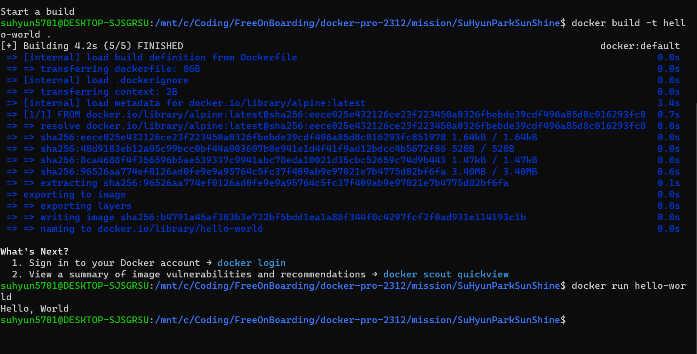

1. 컨테이너 기술이란 무엇입니까? (100자 이내로 요약) 
컨테이너는 애플리케이션과 필요한 모든 파일을 하나의 런타임 환경으로 묶는 데 사용하는 기술이며, 컨테이너는 모든 컨텍스트의 모든 운영 체제에서 쉽게 이동 및 실행할 수 있습니다.

2. 도커란 무엇입니까? (100자 이내로 요약) 
Go언어로 작성된 리눅스 컨테이너 기반으로 하는 오픈소스 가상화 플랫폼이다. 다시 말해 특정한 서비스를 패키징하고 배포하는데 유용한 오픈소스 프로그램이다.

3. 도커 파일, 도커 이미지, 도커 컨테이너의 개념은 무엇이고, 서로 어떤 관계입니까?

    1) 도커 파일 (Dockerfile): 도커 파일은 도커 이미지를 만들기 위한 설정 파일입니다. 일종의 스크립트로, 어떤 환경에서 어떤 소프트웨어를 실행할지 등을 정의합니다. 도커 파일에는 기본 이미지, 소프트웨어 설치, 환경 설정, 파일 복사 등의 명령이 기술됩니다.

    2) 도커 이미지 (Docker image): 도커 이미지는 소프트웨어와 그 실행에 필요한 모든 것들을 포함하는 패키지입니다. 도커 이미지는 도커 파일을 기반으로 빌드되며, 여러 계층(layer)으로 구성됩니다. 이미지는 읽기 전용이며, 실행될 때 컨테이너로 인스턴스화됩니다.
    
    3) 도커 컨테이너 (Docker container): 도커 컨테이너는 도커 이미지를 실행한 상태입니다. 실행 중인 프로세스, 파일 시스템 및 네트워크 등을 포함하며, 격리된 환경에서 독립적으로 실행됩니다. 여러 개의 컨테이너는 동일한 이미지를 기반으로 할 수 있지만, 각각 독립적으로 실행됩니다.

    - 관계: 도커 파일은 도커 이미지를 만들기 위한 레시피이다. 도커 파일을 통해 도커 이미지를 빌드한다. 도커 이미지는 도커 파일을 기반으로 만들어진 패키지이다. 이미지를 이용해 컨테이너를 실행하게 된다. 도커 컨테이너는 도커 이미지를 실행한 것이며, 실행 중인 독립적인 환경을 제공한다. 간단히 말하면, 도커 파일은 이미지를 만들기 위한 설정을 정의하고, 이미지는 소프트웨어와 환경을 포함하는 패키지이며, 컨테이너는 실행 중인 이미지의 인스턴스라고 할 수 있습니다.

    4) [실전 미션] 도커 설치하기 (참조: 도커 공식 설치 페이지)
    
    