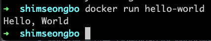

### 컨테이너 기술이란 무엇입니까? (100자 이내로 요약)
컨테이너는 운영체제 가상화의 한 형태로, 실행에 필요한 모든 파일을 포함하고 있다.
VM과 유사하나 VM에 비해 훨씬 가볍고 빠르다.
### 도커란 무엇입니까? (100자 이내로 요약)
소프트웨어를 컨테이너로 패키징하여 신속하게 구축, 테스트 및 배포할 수 있도록 하는 플랫폼이다.
도커는 리눅스 커널 기능을 사용하여 운영 체제 위에 컨테이너를 만들고, 도커 자체는 서비스의 컨테이너를 관리하는 데몬으로 실행된다.
  
### 도커 파일, 도커 이미지, 도커 컨테이너의 개념은 무엇이고, 서로 어떤 관계입니까?
#### - 도커 파일
도커 파일은 도커 이미지를 생성하기 위한 지시사항들을 포함하는 텍스트 파일이다.  
이는 도커 이미지를 구성하는 과정을 자동화하고, 이미지를 빌드하는 방법에 대해 정의한다.
#### - 도커 이미지
소프트웨어를 패키징하고 전송하기 위해 도커 이미지를 사용하는데,
도커 이미지는 파일 형태로, 실행에 필요한 독립적인 환경을 포함하는 일종의 템플릿이다.  
실행에 필요한 파일에는 소스코드, 라이브러리, 종속성, 도구 및 설치파일 등이 포함된다.

#### - 도커 컨테이너
도커 이미지가 레시피라면, 도커 컨테이너는 음식으로 비유할 수 있다. 도커 이미지를 실행한 상태로, 사용자가 기본 시스템에서 
애플리케이션을 분리할 수 있는 가상화된 런타임 환경이다.
이를 통해 응용 프로그램이 동일한 환경에서 작동하도록 하고, 신속하게 공유할 수 있다.
### [실전 미션] 도커 설치하기 (참조: 도커 공식 설치 페이지)
