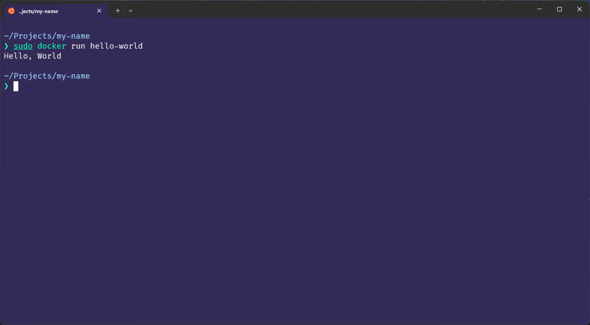

# 컨테이너 기술이란 무엇입니까? (100자 이내로 요약)
컨테이너 기술은 애플리케이션과 필요한 의존성들을 하나의 패키지로 묶어, 다양한 환경에서 동일하게 작동하도록 하는 기술입니다. 이는 애플리케이션의 배포와 확장을 간편하게 해줍니다.

# 도커란 무엇입니까? (100자 이내로 요약)
도커(Docker)는 컨테이너 기술을 활용하여 애플리케이션과 의존성을 패키지화하고, 이를 일관되게 실행하는 오픈소스 플랫폼입니다. 이를 통해 애플리케이션의 배포와 운영을 간편하게 할 수 있습니다.

# 도커 파일, 도커 이미지, 도커 컨테이너의 개념은 무엇이고, 서로 어떤 관계입니까?

도커 파일(Dockerfile): 도커 이미지를 생성하기 위한 설정 파일입니다. 내부에는 애플리케이션을 실행하는 데 필요한 환경 설정, 필요한 패키지 설치 등이 스크립트 형태로 기록되어 있습니다.

도커 이미지(Docker Image): 도커 파일을 바탕으로 생성된 실행 가능한 소프트웨어 패키지로, 애플리케이션과 그것이 작동하는 데 필요한 모든 것을 포함하고 있습니다. 이는 불변(Immutable)하며, 도커 컨테이너 실행의 기반이 됩니다.

도커 컨테이너(Docker Container): 도커 이미지를 실행한 상태, 즉 인스턴스입니다. 이미지를 실행하면 도커 컨테이너가 되며, 이 컨테이너 내부에서 애플리케이션은 호스트 OS와 독립적으로 실행됩니다.

도커 파일, 도커 이미지, 도커 컨테이너는 서로 연관성이 있습니다. 도커 파일은 도커 이미지를 생성하는 데 사용되며, 도커 이미지는 도커 컨테이너를 실행하는 데 사용됩니다. 이렇게 이 세 가지 요소가 함께 작동하여 도커의 주요 기능인 애플리케이션의 격리와 이식성을 제공합니다

# [실전 미션] 도커 설치하기 (참조: 도커 공식 설치 페이지)
