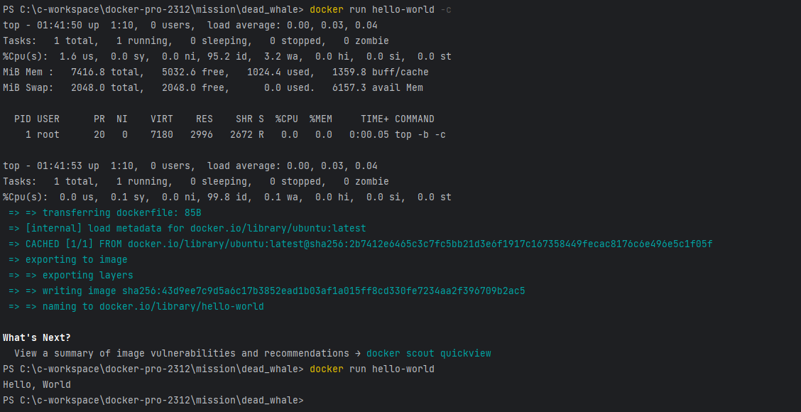

## Q.컨테이너 기술이란 무엇입니까?

**A.** : 어플리케이션에 필요한 모든 환경을 하나의 패키지로 만들어서 실행하는 기술이다.
동일화된 환경에서 어플리케이션을 실행할 수 있게 해준다.

---------

## Q.도커란 무엇입니까?

**A.** : 리눅스 기반의 컨테이너 기술을 사용하여 어플리케이션을 더 쉽게 만들고 배포하고 실행할 수 있도록 해주는 플랫폼이다. 
구글, 아마존, 마이크로소프트에서도 지원할 정도로 표준급의 컨테이너 기술

---------

## Q.도커 파일, 도커 이미지, 도커 컨테이너의 개념은 무엇이고, 서로 어떤 관계입니까?

**A.** :

**도커 파일**: 도커 이미지를 생성하기 위한 설정 파일 환경 설정, 종속성 설치, 실행 명령어 등이 포함된다 
**도커 이미지**: 도커 파일을 기반으로 애플리케이션 실행에 필요한 모든 파일과 설정이 포함된 패키지 , 불편적이다 
**도커 컨테이너**: 이미지를 기반으로 실행한 인스턴스 , 독립된 환경에서 애플리케이션을 실행한다 
**관계:** 도커파일의 빌드를 통해 이미지를 정의하고 이미지로 컨테이너를 생성하고 컨테이너를 통해 애플리케이션을 실행한다. 

---------

## Q.실습

