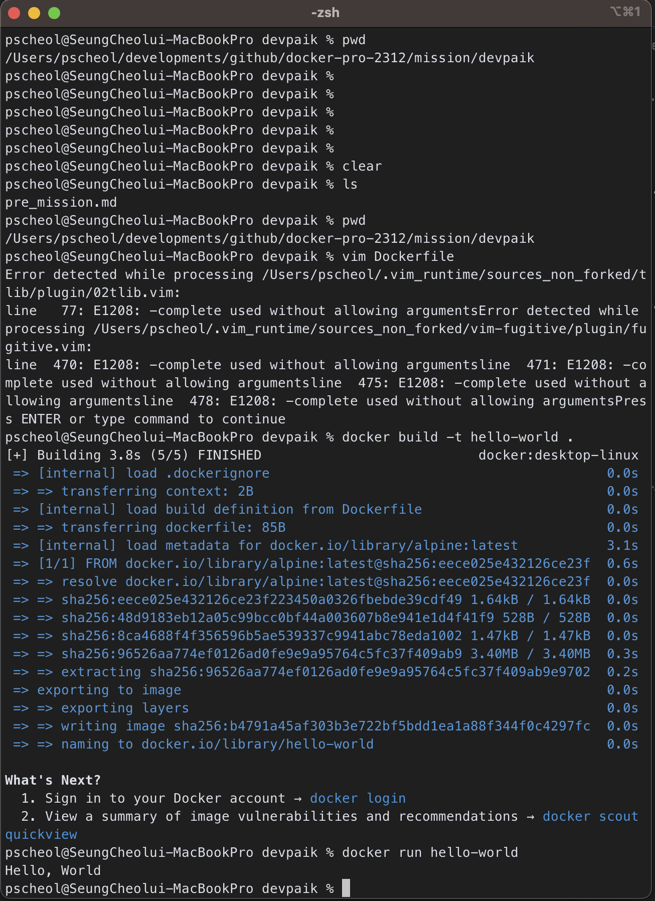

## 1. 컨테이너 기술이란 무엇입니까? (100자 이내로 요약)

- OS 상에 논리적인 구획(컨테이너)를 만들고, 애플리케이션을 작동하기 위해 필요한 라이브러리나 애플리케이션등을 하나로 모아, 별도의 서버인 것 처럼 사용할 수 있게 만드는 것

## 2. 도커란 무엇입니까? (100자 이내로 요약)

- 컨테이너 기술을 사용하여 애플리케이션의 실행 환경을 구축 및 운용하기 위한 플랫폼으로 애플리케이션 실행에 필요한 것을 하나로 모아두고 그 이미지를 사용하여 다양한 환경에서 애플리케이션 실행환경을 구축 및 운용하기 위한 오픈소스 플랫폼이다.

## 3. 도커 파일, 도커 이미지, 도커 컨테이너의 개념은 무엇이고, 서로 어떤 관계입니까?

- 도커 파일(DockerFile) : 이미지를 제작하기 위헤 필요한 환경설정 정보들을 기술해둔 스크립트 파일
- 도커 이미지(Docker-Image) : 서비스 운영에 필요한 서버 프로그램, 소스코드 및 라이브러리 컴파일 된 실행파일들을 묶어놓은 형태.
- 도커 컨테이너(Docker-Container) : 실행가능한 이미지의 인스턴스로, 도커 이미지를 실행하면 컨테이너가 생성되며, 각 컨테이너느 호스트 시스템과 격리된 환경에서 애플리케이션을 실행.
- 도커파일, 도커이미지, 도커컨테이너는 애플리케이션을 배포하기 위한 하나의 사이클.

## 4. [실전 미션] 도커 설치하기 (참조: 도커 공식 설치 페이지)
