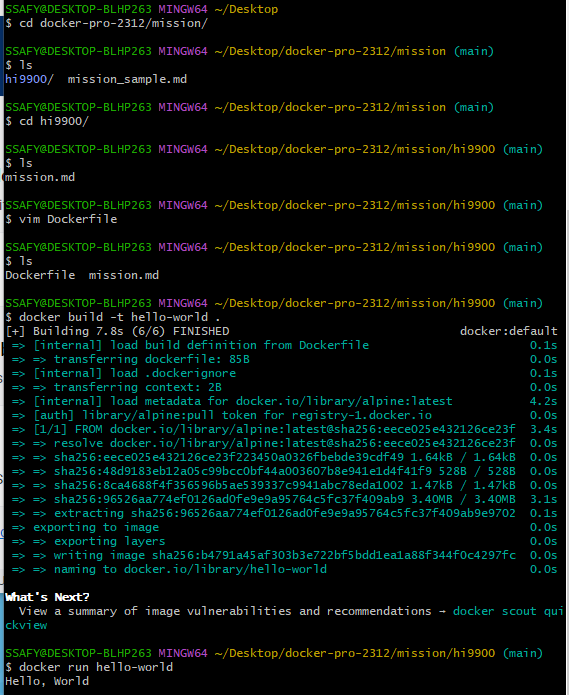

## 1. 컨테이너 기술이란 무엇입니까? (100자 이내로 요약)

컨테이너는 실행에 필요한 모든 파일을 포함한 애플리케이션을 패키징하고 격리할 수 있는 기술이다. 전체 기능을 유지하면서 환경(개발, 테스트, 프로덕션) 간 쉽게 이동할 수 있다.

## 2. 도커란 무엇입니까? (100자 이내로 요약)

컨테이너를 가벼운 모듈식 가상 머신처럼 다룰 수 있게 하는 오픈소스 프로젝트다. 컨테이너 생성 및 구축, 이미지 전송, 이미지 버전 관리 등의 프로세스를 용이하게 해준다.

## 3. 도커 파일, 도커 이미지, 도커 컨테이너의 개념은 무엇이고, 서로 어떤 관계입니까?

도커 엔진에서 사용하는 기본 단위는 이미지와 컨테이너이며, 도커 엔진의 핵심이다.
도커 파일은 도커 이미지를 만들 때 사용하는 파일이며, docker build 명령어를 실행시키면 도커 이미지를 만들 수 있다.
도커 이미지를 docker run 명령어로 실행시키면 도커 컨테이너를 만들 수 있다.

#### 도커 파일(Docker File)

도커 파일은 이미지를 생성하기 위한 용도로 작성하는 파일이다. 작성한 도커 파일의 내용을 기반으로 이미지 빌드가 시작된다. 도커 파일은 명령어들이 나열된 형태로 작성하고, 각 line의 맨 앞은 대문자로 이루어진 지시어(Instruction)로 시작한다.

Docker File 명령어: FROM, LABEL, RUN, CMD, COPY, ADD, USER, ENTRYPOINT, WORKDIR, EXPOSE, ENV, VOLUME 등

#### 도커 이미지(Docker Image)

도커 이미지는 컨테이너를 생성할 때 필요한 요소이다. 이미지는 컨테이너를 생성하고 실행할 때 읽기 전용으로 사용되며 여러 계층으로 된 바이너리 파일로 존재한다.
도커에서 사용하는 이미지의 이름은 기본적으로 `[저장소 이름]/[이미지 이름]:[태그]`의 형태로 구성된다.

저장소 이름: 이미지가 저장된 장소. 저장소 이름이 명시되지 않은 이미지는 도커 허브의 공식 이미지를 뜻함

이미지 이름: 해당 이미지가 어떤 역할을 하는 지 나타내며 필수로 설정해야 함
ex. ubuntu:latest ⇒ 우분투 컨테이너를 생성하기 위한 이미지라는 것을 나타냄

태그: 이미지의 버전을 나타냄. 태그를 생략하면 도커 엔진은 latest로 인식함

#### 도커 컨테이너(Docker Container)

도커 컨테이너는 도커 이미지로 생성할 수 있으며, 컨테이너를 생성하면 해당 이미지의 목적에 맞는 파일이 들어있는 호스트와 다른 컨테이너로부터 격리된 시스템 자원 및 네트워크를 사용할 수 있는 독립된 공간(프로세스)이 생성된다.
컨테이너는 이미지를 읽기 전용으로 사용하되 이미지에서 변경된 사항만 컨테이너 계층에 저장하므로 컨테이너에서 무엇을 해도 원래 이미지는 영향을 받지 않는다. 또한 생성된 각 컨테이너는 각각 독립된 파일 시스템을 제공받으며 호스트와 분리되어 있으므로 특정 컨테이너에서 어떤 어플리케이션을 설치하거나 삭제해도 다른 컨테이너와 호스트는 변화가 없다.

## 4. [실전 미션] 도커 설치하기

