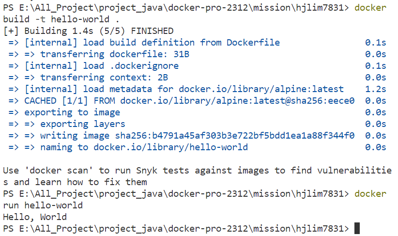

# 사전 미션

### 1. 컨테이너 기술이란 무엇입니까?
* 실행에 필요한 모든 파일을 포함한 전체 실행(runtime)환경에서 애플리케이션을 패키징하고 격리할 수 있는 기술

### 2. 도커란 무엇입니까?
* 애플리케이션 구축, 구현 및 테스트를 위해 격리된 가상화 환경을 생성하는 서비스형 플랫폼

### 3. 도커 파일, 도커 이미지, 도커 컨테이너의 개념은 무엇이고, 서로 어떤 관계입니까?
* **도커 파일** : 도커 이미지를 빌드하는 방법을 정의하는 스크립트
* **도커 이미지** : 애플리케이션 실행에 필요한 독립적인 환경을 포함하고, 런타임 환경을 위한 일종의 템플릿
* **도커 컨테이너** : 사용자가 기본 시스템에서 애플리케이션을 분리할 수 있는 가상화된 런타임 환경. 이미지를 동적인 형태로 변경한 것.

### 4. [실전 미션] 도커 설치하기

