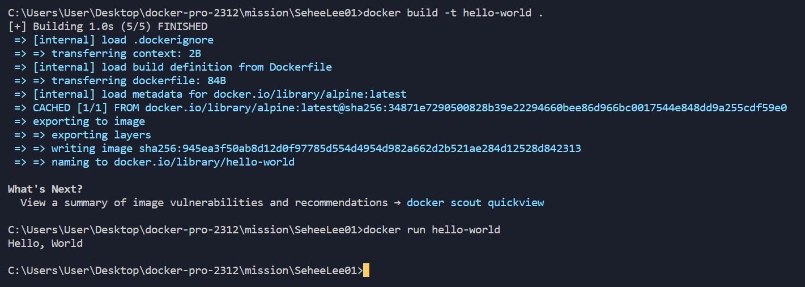

1. 컨테이너 기술이란 무엇입니까? (100자 이내로 요약)

컨테이너 기술은 앱과 그 종속성을 패키징하고 실행하기 위한 가상화 기술을 의미합니다. 이 기술은 컨테이너로 묶어, 이 컨테이너가 다양한 환경에서 일관되게 실행될 수 있도록 합니다.

1. 도커란 무엇입니까? (100자 이내로 요약)

Go언어로 작성된 리눅스 컨테이너 기반으로 하는 오픈소스 가상화 플랫폼이다.

1. 도커 파일, 도커 이미지, 도커 컨테이너의 개념은 무엇이고, 서로 어떤 관계입니까?

**도커 파일 (Dockerfile):**

- 도커 파일은 도커 이미지를 생성하기 위한 설정 파일입니다.
- 개발자는 도커 파일에 애플리케이션의 실행 환경, 종속성, 설정 등을 기술합니다.
- 도커 파일에는 기반 이미지, 애플리케이션 코드 복사, 종속성 설치, 환경 변수 설정 등의 단계가 정의됩니다.

**도커 이미지 (Docker Image):**

- 도커 이미지는 도커 파일을 기반으로 만들어진 실행 가능한 패키지입니다.
- 이미지는 애플리케이션 실행에 필요한 모든 것을 포함하며, 레이어로 구성되어 있습니다.
- 이미지는 읽기 전용이며 변경되지 않습니다. 이미지를 수정하려면 새로운 이미지를 만들어야 합니다.

**도커 컨테이너 (Docker Container):**

- 도커 컨테이너는 도커 이미지를 실행한 인스턴스입니다.
- 컨테이너는 격리된 환경에서 실행되며, 호스트 시스템과는 격리되어 있습니다.
- 이미지를 기반으로 생성된 컨테이너는 실행 중이며, 애플리케이션은 컨테이너 내에서 실행됩니다.
- 여러 컨테이너는 같은 이미지를 기반으로 생성될 수 있습니다.

**관계:**

- 도커 파일은 도커 이미지를 생성하기 위한 설정을 제공합니다.
- 도커 이미지는 도커 파일을 기반으로 만들어진 실행 가능한 패키지로, 여러 컨테이너를 생성할 수 있습니다.
- 도커 컨테이너는 도커 이미지를 실행한 인스턴스로, 각각의 컨테이너는 격리된 환경에서 실행됩니다.

