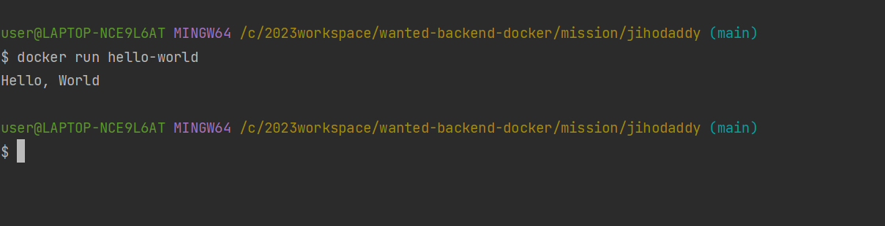

# 사전 미션
### 1.컨테이너 기술이란 무엇입니까? (100자 이내로 요약)
호스트 git OS상에 논리적인 구획(컨테이너)를 만들고, 애플리케이션을 작동시키기 위해 필요한 라이브러리, 애플리케이션 등을 하나로 모아, 별도의 서버인 것처럼 사용할 수 있게 만든 것
- 호스트 OS의 리소스를 논리적으로 분리시키고, 여러 컨테이너가 공유하여 사용
- 오버헤드가 적기 때문에 가볍고 고속으로 작동
- OS나 디렉토리, IP 주소 등과 같은 시스템 자원을 마치 각 애플리케이션이 점유하고 있는것처럼 보이게 함
- 애플리케이션의 실행에 필요한 모든 모듈(파일 및 디렉토리)을 컨테이너로 모을 수 있기 때문에 여러 컨테이너를 조합해 하나의 애플리케이션을 구축하는 마이크로 서비스형 애플리케이션과 친화성이 높음
### 2.도커란 무엇입니까? (100자 이내로 요약)
- 컨테이너 기술을 사용하여 다양한 환경에서 애플리케이션 실행 환경을 구축 및 운용하기 위한 오픈소스 플랫폼
- 애플리케이션 실행에 필요한 것을 하나로 모아, 이미지로 관리함으로서 이식성을 높임
- 이식성이 높기 때문에 클라우드 시스템과의 친화력도 높음
- Docker는 내부에서 컨테이너 기술을 사용하고 있음
### 3.도커 파일, 도커 이미지, 도커 컨테이너의 개념은 무엇이고, 서로 어떤 관계입니까?
- 도커 파일
  >- 도커파일은 docker에서 이미지를 생성하기 위한 용도로 작성하는 파일이다. 
- 도커 이미지
  >- Docker image는 파일로 어플리케이션 실행에 필요한 독립적인 환경을 포함하며, 런타임 환경을 위한 일종의 템플릿이다.
  >- 도커 이미지는 소스 코드, 라이브러리, 종속성, 도구 및 응용 프로그램을 실행하는데 필요한 기타 파일을 포함하는 불변파일이다.
- 도커 컨테이너
  >- 이미지를 실행한 상태로 응용프로그램의 종속성과 함께 응용프로그램 자체를 패키징 또는 캡슐화하여 격리된 공간에서 프로세스를 동작시키는 기술이다.
  >- 사용자가 기본 시스템에서 애플리케이션을 분리할 수 있는 가상화된 런타임 환경이다.
  >- 중요 기능은 컨테이너 내부에서 실행되는 컴퓨팅 환경의 표준화다.
  >- 응용 프로그램이 동일한 환경에서 작동하도록 할 뿐아니라 다른 사람과의 공유도 단순하다.
  >- 컨테이너는 자율적이기 때문에 strong isolation을 제공하며 서로 방해하지 않는다(격리)
### [실전 미션] 도커 설치하기 (참조: 도커 공식 설치 페이지)
