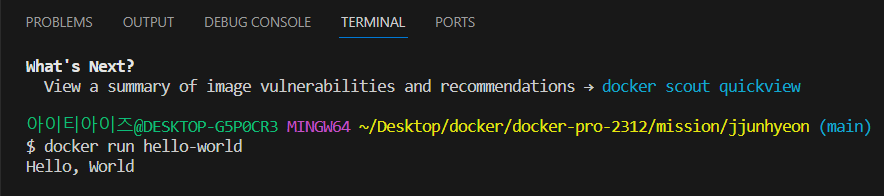

# 사전과제
---
## Mission 1
### 컨테이너 기술이란 무엇입니까? (100자 이내로 요약)

애플리케이션을 패키징하고, 패키징한 애플리케이션을 실행하는 환경을 격리시켜주는 기술

여기서 격리 시킨다는 뜻은 호스트 시스템이 실행하는 컨테이너에 영향을 주지도 않으며, 컨테이너 끼리도 서로 영향을 주지 않는다는 의미

 

### 도커란 무엇입니까? (100자 이내로 요약)
도커는 컨테이너 기반의 가상화 플랫폼으로, 소프트웨어를 컨테이너에 싸서 실행할 수 있도록 하는 오픈 소스 플랫폼이다.

이는 응용 프로그램을 개발, 배포 및 실해하기 위한 경량화된, 표준화된 환경을 제공한다.

### 도커 파일, 도커 이미지, 도커 컨테이너의 개념은 무엇이고, 서로 어떤 관계입니까?

***도커 파일***

도커 이미지를 빌드하기 위한 스크립트 형태의 파일

해당 파일에는 베이스 이미지, 환경 변수 정보 등 이미지를 생성하는데 필요한 정보가 포함된다.

 

***도커 이미지***

소프트웨어을 실행하는데 필요한 모든 것을 포함하는 독립적인 패키지, 이미지는 응용 프로그램 코드, 런타임, 시스템 도구, 라이브러리 등과 같은 모든 것을 포함할 수 있다.

 

***도커 컨테이너***

컨테이너는 실행 가능한 이미지 인스턴스, 격리된 환경에서 실행되며 호스트 시스템과는 격리되어 있지만 필요한 리소스를 공유할 수 있다.

 

***정리***

<U>도커 파일</U>이라는 스크립트 형태의 파일을 통해 <U>도커 이미지</U>를 생성하고 이미지를 빌드하는 곳이 <U>컨테이너</U>, 이러한 모든 작업을 할 수 있개 해주는 플랫폼이 <U>도커</U>

---
## Mission 2
## [실전 미션] 도커 설치하기 (참조: 도커 공식 설치 페이지)

## 아래 도커 설치부터 실행 튜토리얼을 참조하여 도커를 설치하고, 도커 컨테이너를 실행한 화면을 캡쳐해서 Pull Request에 올리세요.

*아래 실행 결과*
