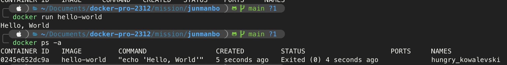

1. 컨테이너 기술이란 무엇입니까? (100자 이내로 요약)
    - 운영 체제의 커널이 여러 격리된 사용자 공간 인스턴스를 갖출 수 있도록 하는 가상화 방식을 의미합니다. 이를 통해, 컨테이너는 모듈화되고 격리된 컴퓨팅 공간 또는 컴퓨팅 환경을 제공합니다.

2. 도커란 무엇입니까? (100자 이내로 요약)
    - Docker는 소프트웨어를 컨테이너로 표준화하여 신속하게 구축, 테스트, 배포할 수 있는 기술입니다. 

3. 도커 파일, 도커 이미지, 도커 컨테이너의 개념은 무엇이고, 서로 어떤 관계입니까?
    - Dockerfile: Dockerfile은 Docker가 Docker 이미지를 구축하는 방법에 대한 지시사항을 포함하는 텍스트 파일입니다. Dockerfile을 작성하고 빌드 명령을 실행하면 Docker 이미지가 생성됩니다.
    - Docker Image: Docker 이미지는 Dockerfile을 빌드하여 생성된 결과물입니다. 이 이미지는 컨테이너가 실행되는 파일 시스템으로, 모든 컨테이너는 이미지를 바탕으로 실행됩니다. Docker 이미지는 애플리케이션 실행에 필요한 모든 파일을 패키징한 형태로, 이를 통해 어플리케이션을 다른 환경으로 쉽게 이동시킬 수 있습니다.
    - Docker Container: Docker 컨테이너는 Docker 이미지를 실행한 결과물입니다. Docker 컨테이너는 Docker 이미지의 인스턴스로 생각할 수 있으며, 이 컨테이너는 이미지를 바탕으로 실행되는 격리된 실행 공간입니다.
    - Dockerfile을 통해 Docker 이미지를 빌드하고, 이 이미지를 바탕으로 Docker 컨테이너를 실행함으로써, 동일한 애플리케이션을 다양한 환경에서 일관성 있게 실행할 수 있습니다.

4. [실전 미션] 도커 설치하기 (참조: 도커 공식 설치 페이지)
    - 도커 컨테이너 실행 화면
    
