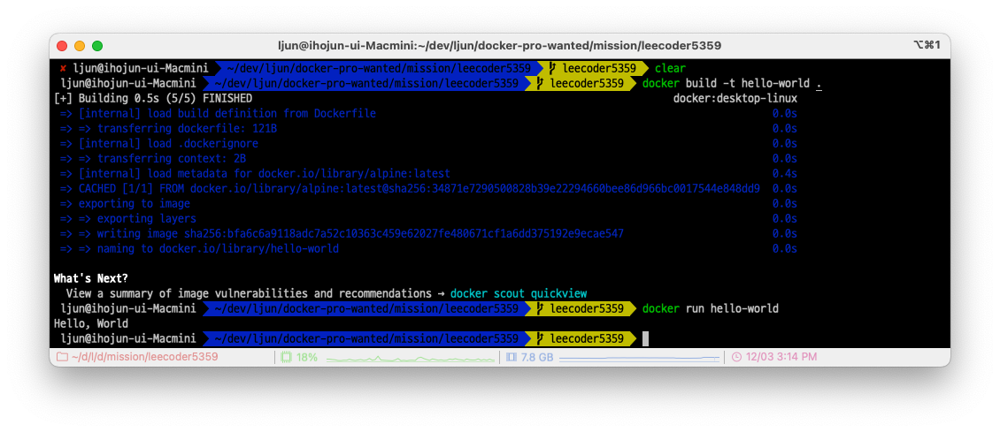

# 컨테이너 기술이란 무엇입니까? (100자 이내로 요약)

컨테이너는 애플리케이션을 환경에 구애 받지 않고 실행하는 기술이다.
운영체제에서 실행되는 프로세스를 격리하여 별도의 실행 환경을 제공해주며, 
해당 프로세스는 운영 체제 상에서 실행되는 유일한 프로세스인 것처럼 작동하는 기술
즉, 별도의 운영 환경을 제공해주는 기술

---
# 도커란 무엇입니까? (100자 이내로 요약)

도커는 컨테이너 기술을 기반으로 한 일종의 가상화 플랫폼입니다. 
가상화란 물리적 자원인 하드웨어를 효율적으로 활용하기 위해서 하드웨어 공간 위에 가상의 머신을 만드는 기술이고, 
컨테이너란 컨테이너가 실행되고 있는 호스트 os의 기능을 그대로 사용하면서 프로세스를 격리해 독립된 환경을 만드는 기술을 뜻합니다.
---
# 도커 파일, 도커 이미지, 도커 컨테이너의 개념은 무엇이고, 서로 어떤 관계입니까?

* 도커 이미지: 파일 시스템과 실행 가능한 프로그램을 포함하는 가상화된 환경을 패키징한 것
* 도커 파일: 도커 이미지를 생성하기 위한 빌드 스크립트
* 도커 컨테이너: 도커 이미지의 인스턴스로 실행 중인 프로세스

### 관계
도커 파일을 사용하여 도커 이미지를 생성하고, 해당 이미지를 실행하여 도커 컨테이너를 만들어 애플리케이션을 실행하고 관리합니다.

---
# [실전 미션] 도커 설치하기
