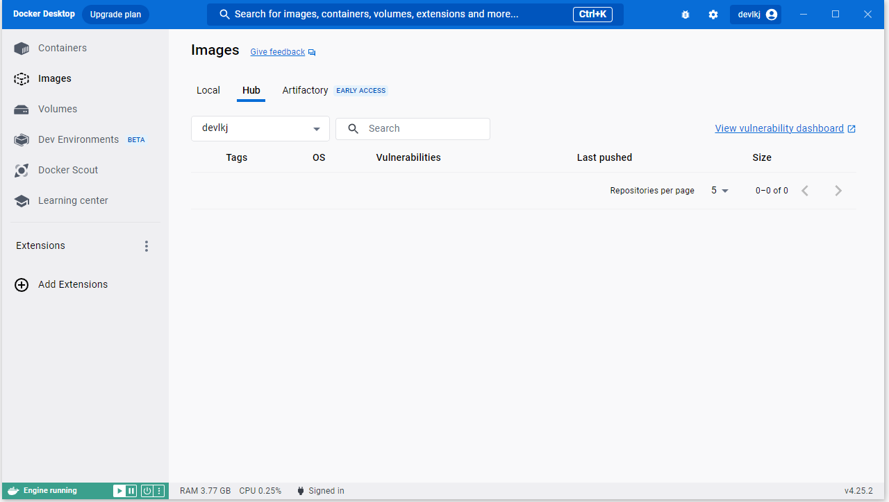

1.컨테이너 기술이란 무엇입니까? (100자 이내로 요약)
하나의 컴퓨터에서 성격이 다른소프트웨어를 각 Software의 실행환경을 독립적으로 운용할 수 있도록 기반환경을 만들어 주고,
실행의 독립성을 확보해주는 운영체계 수준의 격리 기술

2.도커란 무엇입니까? (100자 이내로 요약)
특정 서비스를 패키징하고 배포하는데 유용한 오픈소스 프로그램

3.도커 파일, 도커 이미지, 도커 컨테이너의 개념은 무엇이고, 서로 어떤 관계입니까?

도커 파일: 이미지 생성 출발점. 만들 이미지에 대한 정보를 기술한 템플릿
도커 이미지 : 컨테이너를 실행할 수 있는 실행파일, 설정 값들을 가지고 있는 것
도커 컨테이너 : 응용프로그램을 빠르게 쉽게 시작할 수 있는 portable units

컨테이너가 존재하려면 이미지를 실행해야 하는 반면, 이미지는 컨테이너 없이 존재할 수 있음.
Dockerfile - (Build) -> Image -(Create) -> Container

4.[실전 미션] 도커 설치하기 (참조: 도커 공식 설치 페이지)

아래 도커 설치부터 실행 튜토리얼을 참조하여 도커를 설치하고, 도커 컨테이너를 실행한 화면을 캡쳐해서 Pull Request에 올리세요.
