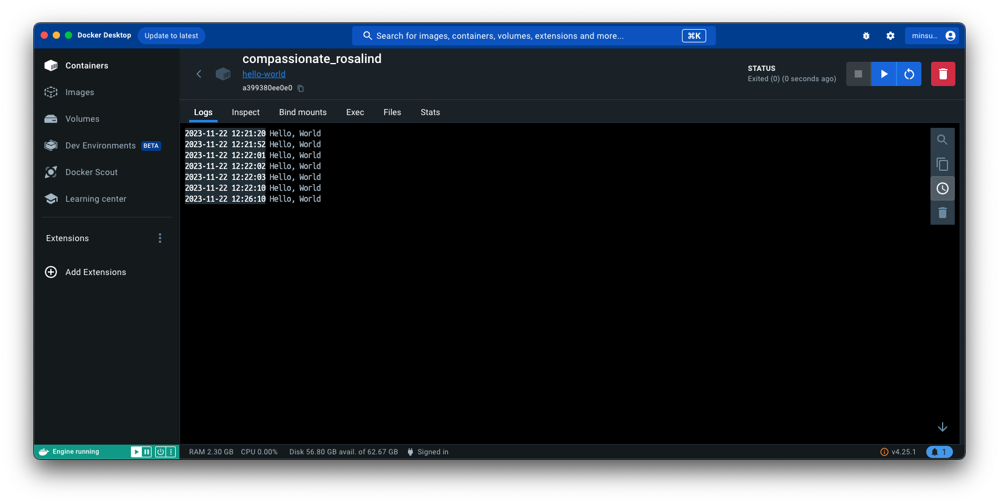

# 1. 컨테이너 기술이란?

컨테이너는 애플리케이션을 구동하는 데 필요한 모든 파일을 하나의 런타임 환경으로 묶는 데 사용하는 기술을 의미한다. 컨테이너 기술을 사용하는 이유는 크기, 속도, 이동성, 모듈성 등의 이점을 얻기 때문입니다.

# 2. 도커란?

도커는 컨테이너 기반 가상화 기술로, 애플리케이션을 독립된 환경에서 실행하고 관리하는 플랫폼.

# 3. 도커 파일, 도커 이미지, 도커 컨테이너의 개념은 무엇이고, 서로 어떤 관계입니까?

도커 파일(Dockerfile)

- 애플리케이션 실행에 필요한 환경과 설정을 정의하는 텍스트 파일.

도커 이미지(Docker image)

- 도커 파일을 기반으로 만들어진 가상 환경을 담은 패키지.

도커 컨테이너(Docker container)

- 도커 이미지를 실행한 가상 환경의 인스턴스로, 격리된 환경에서 애플리케이션을 실행.

3가지 관계

- 도커 파일은 도커 이미지를 만들기 위한 레시피이며, 도커 이미지는 도커 컨테이너의 실행 환경과 애플리케이션을 패키징한 것. 도커 컨테이너는 이미지의 인스턴스로, 여러 개의 컨테이너는 동일한 이미지에서 생성될 수 있다. 이러한 구조는 애플리케이션을 효율적으로 배포, 관리, 확장할 수 있게 해준다.

# 4.실전 미션 도커 설치하기

