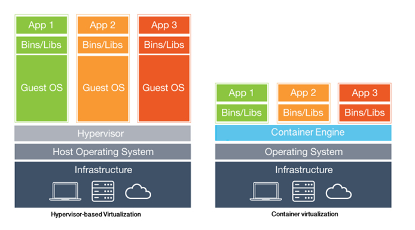
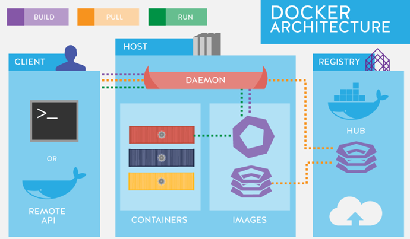

# 원티드 챌린지 12월 사전 미션

---
## 컨테이너 기술이란 무엇입니까?
컨테이너 기술이란 2000년대 중반 리눅스에 내장된 LXC(Linux Container) 기술로부터
처음 소개되었으며, LXC는 단일 머신상에 여러 개의 독립된 리눅스 컨테이너를 실행하기
위한 OS 레벨의 가상화 기법이다. 이 LXC가 컨테이너 기술의 시초이다.

네트워크, 스토리지, 보안 등 각 영역마다 정책이 서로 다르기 때문에 프로그램들은
환경이 바뀔 때마다 각종 오류가 발생, 이는 개발자들의 오랫 골칫거리로 소프트웨어가
현재 컴퓨팅 환경에서 다른 환경으로 이동하더라도 안정적으로 실행되도록 하기 위해
나온 개념이 바로 컨테이너라고 볼 수 있다.

근래에는 기존의 하이퍼바이저 기반의 가상화 기술을 컨테이너 기반 가상화가 대체하고
있다.

__하이퍼바이저__

호스트 컴퓨터로 다수의 운영체제를 동시에 실행하기 위한 논리적 플랫폼으로서 게스트
OS와 그 OS에서 구동되는 프로그램을 실제 물리적 장치에서 분리하는 프로세스를
가리킨다. 주로 소프트웨어 형태로 구현되며 VMware WorkStation과 같은 가상화
소프트웨어가 대표적이다.

### 컨테이너의 개념 및 구조
컨테이너는 모듈화되고 격리된 컴퓨팅 공간 또는 컴퓨팅 환경, 다시 말해 어플리케이션을 구동하는
환경을 격리한 공간을 의미한다.

기본적으로 가상화를 위해 하이퍼바이저와 게스트 OS가 필요했던 것과는 달리, 컨테이너는 운영 체제를
제외하고 어플리케이션 실행에 필요한 모든 파일만을 패키징한 형태, 그만큼 기존의 가상 머신에 비해
가볍고 빠르게 동작이 가능하다.

운영 체제의 커널이 여러 격리된 사용자 공간 인스턴스를 갖출 수 있도록 하는 가상화 방식이기 때문에
*OS 레벨 가상화*라고 불린다.

*<출처: Peter's Story - WordPress.com>*

어플리케이션 실행에 필요한 필요한 라이브러리, 바이너리, 기타 구성 파일 등을 패키지로 묶어서
배포하는 방식이다. 따라서 구동 환경이 바뀌어도 실행에 필요한 파일이 함께 따라다니기 때문에
오류를 최소화할 수 있다.

__바이너리__

컴퓨터 저장과 처리 목적을 위해 이진수 형식으로 인코딩된 데이터 파일을 의미하는 것으로 
코드의 컴파일 또는 압축된 결과물

### 컨테이너 기술 특성
#### 경량화

컨테이너가 서버 가상화 기술을 대체하며 인기를 끌고 있는 큰 이유는 가볍기 때문이다.
기존 서버에 하이퍼바이저를 설치하고, 그 위에 가상 OS(게스트 OS)와 앱을 패키징한 VM을
만들어 실행하는 방식인 *하드웨어 레벨*의 가상화와는 달리 컨테이너는 게스트 OS와 하이퍼바이저가
없는 *OS 레벨* 가솽화 구조이기 때문에 시스템에 대한 요구사항이 적다.

그리고 컨테이너에는 OS가 포함되지 않아 크기가 수십 MB에 불과하며 OS 부팅이 필요하지 않아
서비스 시작 시간 또한 매우 빠르다. 또한 가볍기 때문에 컨테이너에 대한 복제와 배포가 용이하다.

반면, VM에는 게스트 OS가 포함되므로 크기가 수 GB를 넘고, 각각의 게스트 OS마다 OS 구동에
필요한 하드웨어의 가상 복제본(CPU, RAM 등)을 모두 구동해야 하기 때문에 시스템 자원 또한
많이 소모한다.

또한 컨테이너는 더 많은 응용프로그램을 더 쉽게 하나의 물리적 서버에서 구동시키는 것이
가능하기 때문에 마이크로 서비스 구축에 최적화되어 있다.

#### 컴퓨팅 자원
컨테이너는 생성 및 실행되면 마치 OS 위에서 하나의 어플리케이션이 동작하는 것과 동일한 
수준의 컴퓨팅 자원만을 필요로 한다. 때문에 기존의 VM 방식 대비 시스템의 성능 부하가 훨씬
적은 편이다.

그리고 컨테이너에서 실행중인 서비스에 더 많은 가용성이 필요하거나 반대로 필요 없을 때, 
CPU 사용량 또는 사용자가 설정한 임계치에 따라 자동으로 확장 및 축소가 가능하다.

#### 구동 방식
컨테이너는 특정 클라우드 어플리케이션이 실행되기 위한 모든 라이브러리와 바이너리 파일 등이
패키지화되어 있기 때문에 기존의 시스템에서 실행하는 식으로 구동 방식이 간단하다.

반면, VM 방식은 특정 어플리케이션을 실행하기 위해 먼저 새로운 VM을 띄우고 자원을 할당한
다음, 필요한 게스트 OS를 부팅한 후 어플리케이션을 실행시켜야 한다.

#### 안정성
컨테이너 기술은 위와 같은 여러 장점이 있으나 안정성이 있어서는 우려되는 부분이 존재한다.

VM 방식은 VM들이 각각 독립된 형태로 완전히 분리되어 있어 안정적 운영이 가능하지만,
컨테이너 방식은 비록 통제된 영역이라 할지라도 *호스트 OS 커널을 공유하는 구조*이기 때문에
한쪽에서 장애가 발생한다면 다른 컨테이너 또한 영향을 받을 수 있다.

## 도커란 무엇입니까?
도커는 오픈소스 기반의 컨테이너 관리 플랫폼으로 컨테이너, 오버레이 네트워크, 유니온 파일 시스템
등 기존에 존재하던 기술들을 잘 조합하여 사용자들이 원하는 기능을 간단하고 획기적으로 구현하였다.

- 오버레이 네트워크 : 물리 네트워크 위에 생성한 가상 네트워크
- 유니온 파일 시스템 : 읽기전용의 파일을 수정할 때 쓰기가 쓰기가 가능한 임시파일을 생성하고
    수정이 완료되면 기존의 읽기전용 파일을 대체하는 형식의 파일 시스템

*<출처: Docker>*

## 도커 파일, 도커 이미지, 도커 컨테이너의 개념은 무엇이고, 서로 어떤 관계입니까?
### 도커 파일
- 도커 파일은 컨테이너 이미지를 빌드하기 위한 텍스트 기반의 스크립트이다.
- 개발자는 도커 파일을 이용하여 어떻게 컨테이너 환경이 구성되고 애플리케이션이 실행되어야 하는지를
    정의한다.
- 주로 기반 이미지 선택, 애플리케이션 코드 복사, 종속성 설치, 환경 설정 등을 포함한다.

### 도커 이미지
- 도커 이미지는 애플리케이션과 그 실행에 필요한 모든 것을 포함하는 가벼운, 실행 가능한 패키지이다.
- 이미지는 도커 파일에 정의된 내용을 기반으로 빌드되며, 한 번 빌드된 이미지는 여러 환경에서 동일하게 
    수행될 수 있다.
- 이미지는 읽기 전용이며 변경할 수 없다. 즉, 이미지가 만들어진 후에는 수정이 불가하다.
- 도커 이미지는 도커 레지스트리에 저장되어 다른 사용자 및 시스템과 공유할 수 있다.

### 도커 컨테이너
- 도커 컨테이너는 실행 가능한 이미지의 인스턴스이다.
- 도커 이미지를 실행하면 컨테이너가 생성되고, 이 컨테이너는 호스트 시스템과 격리된 환경에서
    애플리케이션을 실행한다.
- 컨테이너는 가상화된 운영 체제 환경을 제공하며, 호스트 시스템과는 독립적으로 동작한다.
- 컨테이너는 가볍고 빠르게 시작되며, 여러 컨테이너 인스턴스를 동시에 실행할 수 있어 확장성이 높다.

### 관계
- 도커 파일은 도커 이미지를 생성하기 위한 빌드 스크립트를 정의한다.
- 도커 이미지는 도커 파일을 기반으로 빌드되며, 여러 개의 이미지가 도커 레지스트리에 저장될 수 있다.
- 도커 컨테이너는 실행 가능한 이미지의 인스턴스로, 이미지를 실행하면 컨테이너가 생성되어 애플리케이션이
    실행된다.

### [실전 미션] 도커 설치하기