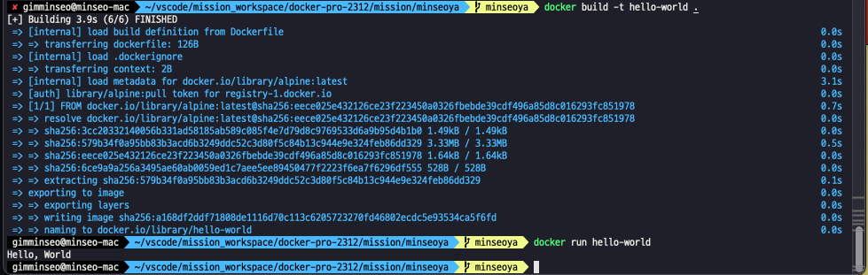

# 1. 컨테이너 기술이란 무엇입니까(100자)

컨테이너는 애플리케이션과 관련 파일을 한 패키지로 묶어 독립된 실행 환경을 만들어주는 기술입니다. 이렇게 패키지된 컨테이너는 어디서든 쉽게 이동하고 실행할 수 있습니다. (컨테이너에는 라이브러리, 시스템 도구, 코드, 런타임 등 소프트웨어를 실행하는데 필요한 모든 것이 포함되어 있다.)

컨테이너를 사용하면 소프트웨어를 격리하고 다른 운영 체제, 하드웨어, 네트워크, 스토리지 시스템 및 보안 정책에서 독립적으로 작업할 수 있습니다. 컨테이너 기반 애플리케이션을 개발, 테스트 및 생산 환경 전반에서 원활하게 전환할 수 있습니다. 운영 체제가 컨테이너에 포함되어 있지 않기 때문에 각 컨테이너는 최소한의 컴퓨팅 리소스를 사용하여 설치가 단순하고 간편합니다.

컨테이너를 사용하여 사용자는 호환되지 않는 환경으로 인해 발생하는 충돌을 방지하고 시스템 전반에서 일관된 성능을 얻을 수 있습니다. 개발자는 디버깅 또는 다양한 서버 환경에 대한 다시 쓰기가 아닌 애플리케이션 자체에 집중할 수 있습니다. 또한 운영 체제가 없어 개발자가 클러스터에 컨테이너를 효율적으로 구축할 수 있으며 개별 컨테이너에 복잡한 애플리케이션의 단일 구성 요소가 포함됩니다. 구성요소를 개별 컨테이너에 분류하여 개발자들은 전체 애플리케이션을 다시 작업하지 않고 개별 구성요소를 업데이트할 수 있습니다.

# 2. 도커란 무엇입니까? (100자 이내로 요약)

도커는 컨테이너 기반 가상화 플랫폼으로, 애플리케이션과 환경을 격리하여 이식성과 효율성을 높이며, 간편한 배포와 관리를 가능케 하는 소프트웨어입니다.

# 3.도커 파일, 도커 이미지, 도커 컨테이너의 개념은 무엇이고, 서로 어떤 관계입니까?

## 도커 파일 (Dockerfile)

도커 파일은 도커 이미지를 생성하는 설정 파일입니다. 주로 이미지를 구성하기 위한 명령어들이 포함되어 있으며 베이스 이미지, 소스 코드 복사, 의존성 설치, 환경 설정 등이 기술됩니다.

## 도커 이미지 (Docker Image)

도커 이미지는 도커 파일을 기반으로 빌드된 실행 환경을 담고 있는 파일입니다. 애플리케이션을 실행하는 데 필요한 모든 것을 포함하며, 도커 컨테이너를 생성하는 템플릿 역할을 합니다.

## 도커 컨테이너 (Docker Container)

도커 컨테이너는 도커 이미지를 실행한 상태입니다. 이미지를 기반으로 생성된 가상 환경에서 애플리케이션이 동작하는 격리된 공간이며, 호스트 시스템과는 독립적으로 동작합니다.

## 관계

1. **도커 파일과 도커 이미지:** 도커 파일은 도커 이미지를 빌드하기 위한 설정을 제공합니다.

2. **도커 이미지와 도커 컨테이너:** 이미지는 컨테이너를 생성하는 데 사용되며, 컨테이너는 해당 이미지를 실행한 상태입니다.

3. **도커 파일과 도커 컨테이너:** 도커 파일은 이미지를 정의하고, 해당 이미지는 컨테이너를 실행할 때 파일 시스템과 실행 환경을 제공합니다.

따라서 도커 파일은 이미지를 생성하고, 이미지는 컨테이너를 실행하는 템플릿으로 사용됩니다.

