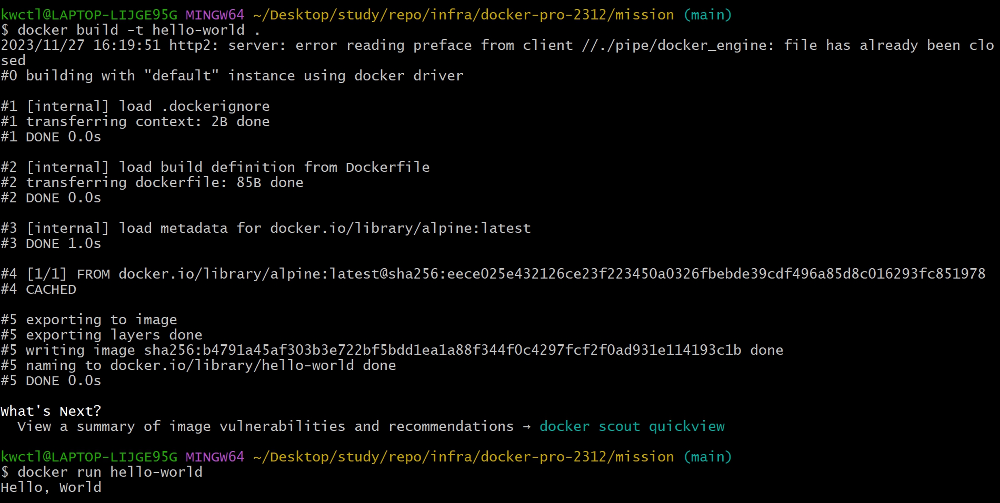

1. 컨테이너 기술이란 무엇입니까? (100자 이내로 요약)
    1. 장치/운영 체제와 무관하게 특정 운영 체제나 코드를 작동시키는 환경을 의미합니다.
2. 도커란 무엇입니까? (100자 이내로 요약)
    1. 도커는 장치/ 운영 체제와 무관하게 특정한 애플리케이션을 빠르게 작동시키는 오픈 플랫폼 입니다.
3. 도커 파일, 도커 이미지, 도커 컨테이너의 개념은 무엇이고, 서로 어떤 관계입니까?
    1. 도커 파일: 도커 이미지를 생성하는데 필요한 명령어들을 모아둔 문서.
    2. 도커 이미지: 도커 컨테이너를 생성하는 절차를 담고 있는 읽기 전용 템플릿입니다.
    3. 도커 컨테이너: 특정 코드, 애플리케이션, 시스템을 작동하기 위한 모든 필요한 요소들을 가지고 있는 파일 시스템입니다.
    4. 도커 이미지를 작동 시키기 위한 코드의 모음이 도커 파일에 위치합니다.
    5. 도커 컨테이너를 구동하기 위하여 도커 이미지가 작동하게 됩니다.
4. 실습 결과 이미지
   1. 결과 이미지 
