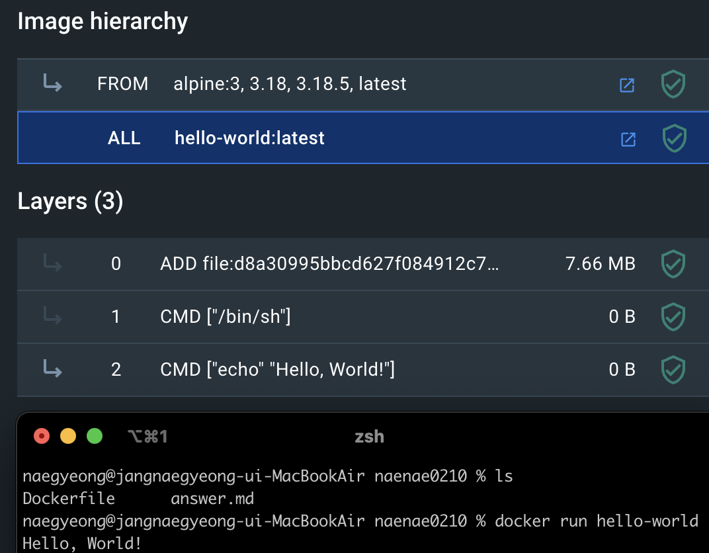

### 컨테이너 기술이란 무엇입니까? (100자 이내로 요약)
- 가상화 기술로, 애플리케이션을 격리된 환경인 '컨테이너'에 패키징하여 실행하는 방식이다.
  
### 도커란 무엇입니까? (100자 이내로 요약)
- 컨테이너 기술을 사용하여 애플리케이션을 개발, 배포, 실행하기 위한 오픈 소스 플랫폼이다.
    
### 도커 파일, 도커 이미지, 도커 컨테이너의 개념은 무엇이고, 서로 어떤 관계입니까?

- 도커 파일: 텍스트 문서로, 도커 이미지를 생성하는 방법을 기술한다. 명령어와 스크립트로 구성되어 있으며, 애플리케이션과 필요한 모든 종속성을 포함하는 방법을 정의한다.

- 도커 이미지: 도커 파일에서 정의된 지침에 따라 생성된, 읽기 전용의 템플릿이다. 애플리케이션 실행에 필요한 코드, 라이브러리, 환경변수, 파일 등을 포함한다. 도커 이미지는 도커 파일을 통해 빌드된다.

- 도커 컨테이너: 도커 이미지를 실행한 인스턴스이다. 컨테이너는 도커 이미지를 기반으로 실행되며, 이미지에 정의된 애플리케이션 및 서비스를 실행하는 격리된 환경을 제공한다. 각 컨테이너는 별도의 파일 시스템을 가지며, 제한된 리소스에 접근하여 독립적으로 실행된다.

>도커 파일은 레시피, 도커 이미지는 그 레시피로 만든 요리의 냉동판, 도커 컨테이너는 그 냉동 요리를 가열하여 실제로 먹을 수 있게 만든 것.

  
### [실전 미션] 도커 설치하기 (참조: 도커 공식 설치 페이지)**
- 