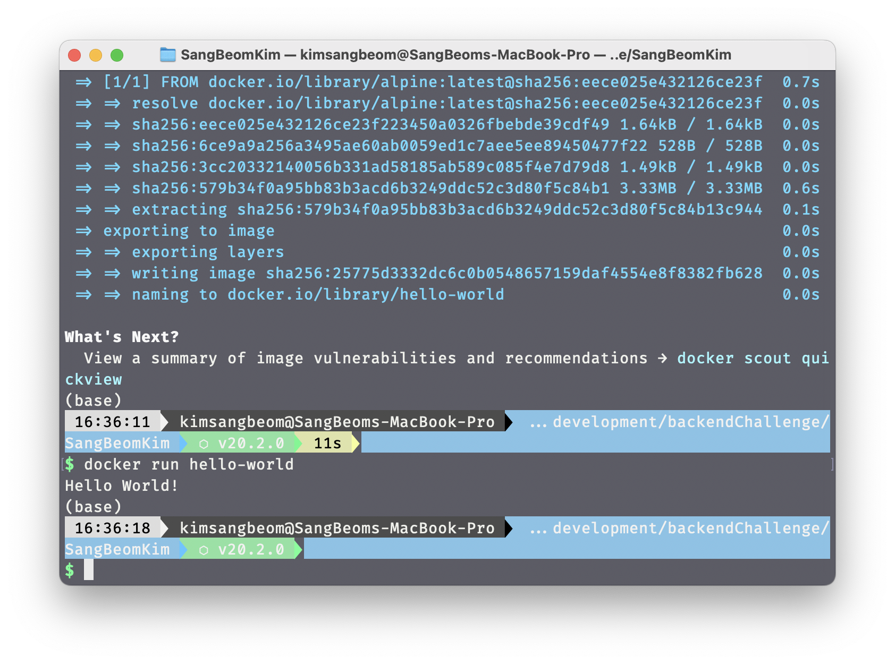

# 1.컨테이너 기술이란 무엇입니까? (100자 이내로 요약)
컨테이너 기술이란 VM과 유사한 개념이나, 호스트 OS의 리소스를 논리적으로 공유하여 VM에 비해 월등한 성능을 가질 수 있는 기술을 의미한다.
컨테이너 기술을 활용하여 서비스에 필요한 기능들을 독립적으로 구성하고, 배포할 수 있다.

# 2. 도커란 무엇입니까? (100자 이내로 요약)
도커란 컨테이너 기술을 활용하여 서비스에 필요한 기능들을 독립적으로 구성하고, 배포할 수 있도록 도와주는 플랫폼이다.

# 3. 도커 파일, 도커 이미지, 도커 컨테이너의 개념은 무엇이고, 서로 어떤 관계입니까?
도커 파일 : 도커 이미지를 생성하기 위한 설정 파일. 의존성 패키지 설치, 소스코드 복사, 포트 설정 등을 정의한다.
도커 이미지 : 도커 파일을 통해 생성된 이미지. 컨테이너를 생성하기 위한 기반이 된다.
도커 컨테이너 : 도커 이미지를 기반으로 생성된 컨테이너. 도커 컨테이너는 독립적으로 실행되며, 서로 영향을 주지 않는다.

# 4. [실전 미션] 도커 설치하기
