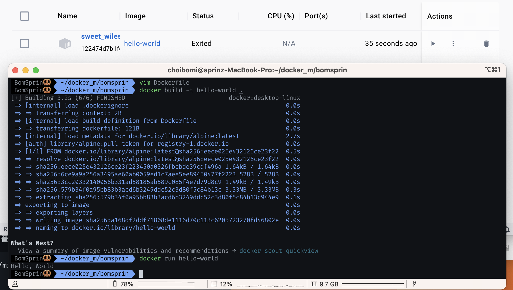

### 컨테이너 기술이란 무엇입니까?
    컨테이너는 어떤 환경에서나 실행하기 위해 필요한 모든 요소를 포함하는 소프트웨어 패키지입니다.

    이러한 방식으로 운영체제를 가상화하며, 퍼블릭 클라우드 또는 개인 노트북 등 어디서나 실행됩니다.
### 도커란 무엇입니까? (100자 이내로 요약)
    도커는 애플리케이션을 개발, 제공 및 실행하기 위한 개방형 플랫폼으로,

    인프라를 애플리케이션을 관리하는 것과 동일한 방식으로 관리할 수 있게 합니다.
    
### 도커 파일, 도커 이미지, 도커 컨테이너의 개념은 무엇이고, 서로 어떤 관계입니까?
    도커 파일 - 사용자가 이미지를 조합하기 위해 커맨드라인에서 호출할 수 있는 모든 명령이 포함된 텍스트 문서입니다.

    도커 이미지 - 컨테이너 내에서 애플리케이션을 실행하는 데 필요한 라이브러리 및 종속성의 스냅샷.

    도커 컨테이너 - 소프트웨어를 패키징하여 모든 대상 시스템에서 실행할 수 있습니다. 
                이전에는, 서로 다른 대상 시스템에 맞게 소프트웨어를 패키징해야 했습니다. 
                (예를 들어, macOS와 Windows에서 애플리케이션을 실행하려면 애플리케이션 설계를 변경하고 다른 시스템에 맞게 패키징해야 했습니다.)

### 아래 도커 설치부터 실행 튜토리얼을 참조하여 도커를 설치하고, 도커 컨테이너를 실행한 화면을 캡쳐해서 Pull Request에 올리세요.
 