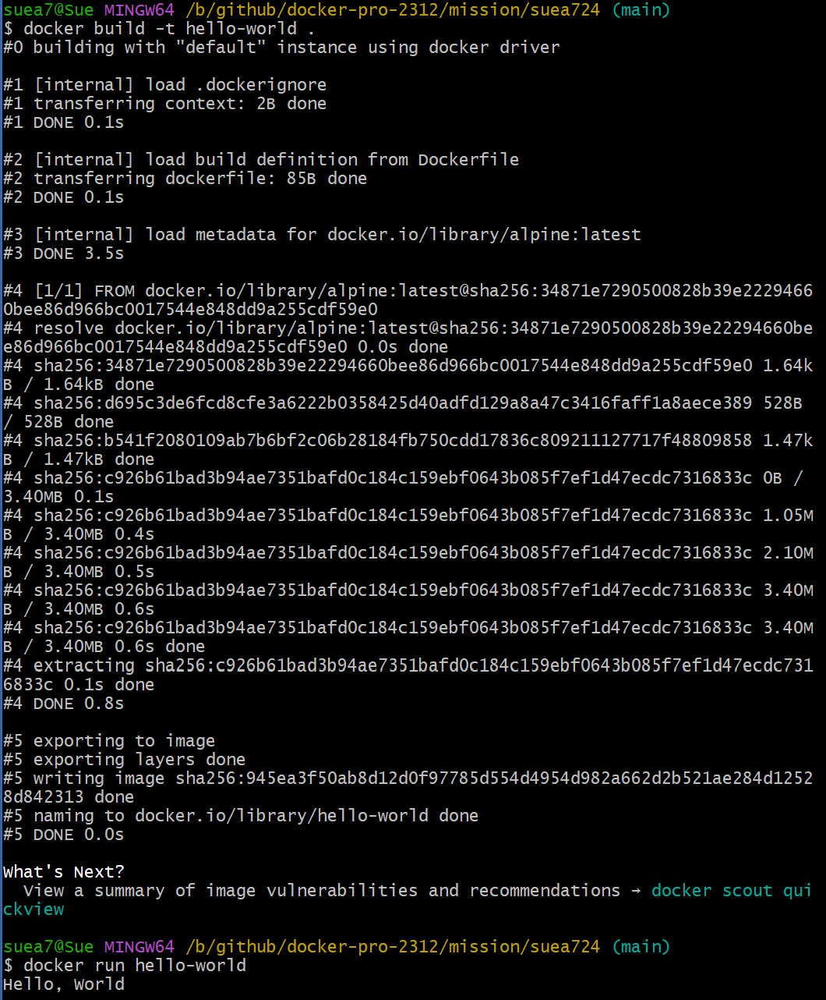

### **1. 컨테이너 기술이란 무엇입니까? (100자 이내로 요약)**

컨테이너 기술은 애플리케이션 실행에 필요한 라이브러리, 바이너리, 기타 구성 파일 등을 패키지화하고 분리하는 기술이다. 구동 환경이 바뀌어도 실행에 필요한 파일이 갖춰져 있기 때문에 오류를 최소화 할 수 있고, OS가 포함되지 않아 가볍다는 특징이 있다.

> **📌<i>가상화 기술과 컨테이너 기술의 차이점?</i>**
 
 
**가상화 기술**은 하이퍼바이저(가상화를 관리하는 소프트웨어)와 게스트 OS가 필요하므로 크기가 수 GB를 넘고 각각의 게스트 OS 마다 운영 체제 구동에 필요한 하드웨어의 가상 복제본을 모두 구동해야 하므로 시스템 자원을 많이 소모한다. (하드웨어 레벨 가상화)
 
 
**컨테이너**는 게스트 OS가 포함되지 않아 크기가 수십 MB에 불과하며, 운영 체제 부팅이 필요하지 않아 서비스 시작 시간이 매우 빠르다. 또한 가벼워서 컨테이너에 대한 복제와 배포가 용이하다. (OS 레벨 가상화)

 

### 2. 도커란 무엇입니까? (100자 이내로 요약)
도커는 리눅스 컨테이너(LXC) 기반의 가상화 소프트웨어다. 컨테이너라고 하는 격리된 환경에서 애플리케이션을 패키징하고 실행하는 기능을 제공한다. 특정 호스트에서 동시에 여러 컨테이너를 실행할 수 있다.

 

### **3. 도커 파일, 도커 이미지, 도커 컨테이너의 개념은 무엇이고, 서로 어떤 관계입니까?**

- **도커 파일** : 도커 이미지를 생성하기 위해 컨테이너에 설치해야 하는 패키지, 소스코드, 실행해야하는 명령어와 쉘 스크립트 등을 저장하는 파일. 도커는 빌드 시 해당 파일을 읽어서 컨테이너에서 작업 수행 후 이미지로 만듦.
- **도커 이미지** : 컨테이너 실행에 필요한 파일과 설정값 등을 포함하고 있는 파일. 상태값을 가지지 않고 변하지 않는 특성이 있다. (Read-Only)
- **도커 컨테이너** : 도커 이미지의 실행 가능한 인스턴스. 실행 중 추가되거나 변하는 값은 컨테이너에 저장됨. 같은 이미지로 여러 컨테이너 생성이 가능함. (Read-Write)

 

### **4. [실전 미션] 도커 설치하기 (참조: 도커 공식 설치 페이지)**

 

---

 

- 참고
    - https://m.blog.naver.com/shakey7/221600166205
    - https://choincnp.tistory.com/68
    - https://choincnp.tistory.com/69
    - https://docs.docker.com/get-started