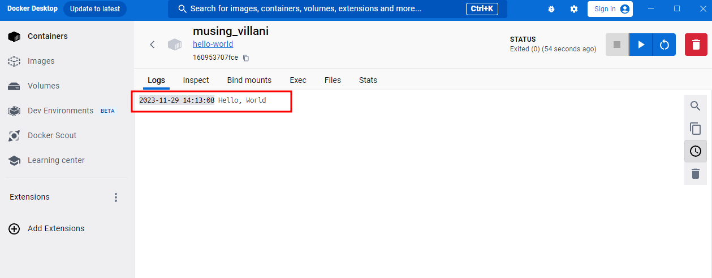
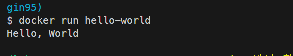

1. 컨테이너 기술이란 무엇입니까? (100자 이내로 요약)
   실행에 필요한 모든 파일을 포함한 전체 실행 환경에서 애플리케이션을 패키징하고 격리할 수 있는 기술
   이를 통해 담당 영역을 분리하여 관리가 편해집니다.
2. 도커란 무엇입니까? (100자 이내로 요약)
   리눅스 컨테이너에 리눅스 에플리케이션을 프로세스 격리기술을 사용하여 더 쉽게 컨테이너로 실행하고 관리할 수 있게 해주는 오픈소스 프로젝트입니다.
3. 도커 파일, 도커 이미지, 도커 컨테이너의 개념은 무엇이고, 서로 어떤 관계입니까?

도커 파일
도커 파일은 도커 이미지를 만들때 사용하는 파일입니다.(docker build 명령어를 통해 도커 이미지를 생성 할 수 있습니다.)

도커 이미지
도커 이미지는 컨테이너를 생성할 때 필요한 요소이며, 1:N의 관계를 갖습니다.(클래스와 인스턴스의 관계랑 비슷합니다.)
docker run을 통해 도커 컨테이너를 만들 수 있습니다.

도커 컨테이너
도커 이미지를 통해 생성 할 수 있고, 해당 이미지의 목적에 맞는 파일이 들어 있는 호스트와 다른 컨테이너로부터 격리된 시스템 자원 및 네트워크를 사용할 수 있는 독립된 공간(프로세스)이 생성됩니다.
이를 통해 컨테이너에서 무엇을 하든 원래 이미지에는 영향이 가지 않고, 특정 컨테이너에서 어떤 어플리케이션을 설치하거나 삭제해도 다른 컨테이너와 호스트는 변화가 없습니다.

4. [실전 미션] 도커 설치하기 (참조: 도커 공식 설치 페이지)
   Docker Desktop 설치 완료

