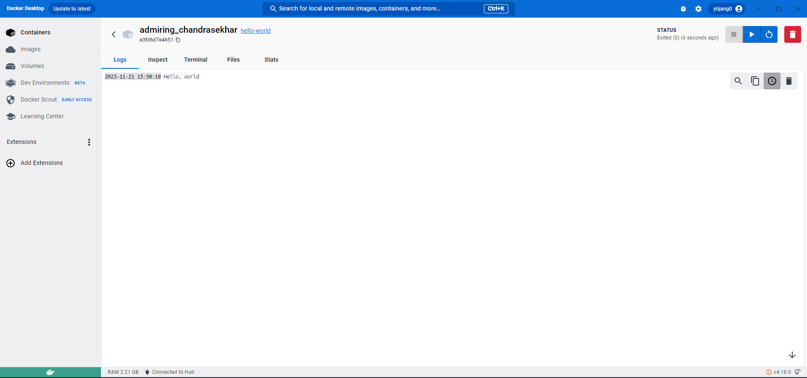

## 사전미션

### 1. 컨테이너 기술이란 무엇입니까? (100자 이내로 요약)
컨테이너 기술은 애플리케이션과 그에 필요한 모든 종속성을 패키지화하여 독립된 환경에서 실행되게 하는 기술입니다. 이로 인해 확장성과 이식성이 향상됩니다.

### 2. 도커란 무엇입니까? (100자 이내로 요약)
도커는 컨테이너 기반의 가상화 기술을 제공하는 오픈소스 플랫폼입니다. 컨테이너 기술을 이용하여 애플리케이션이 다양한 환경에서 일관되게 실행될 수 있도록 도와줍니다.

### 3. 도커 파일, 도커 이미지, 도커 컨테이너의 개념은 무엇이고, 서로 어떤 관계입니까?
- 도커 파일 : 도커 이미지를 빌드하기 위한 스크립트입니다. 파일에는 어플리케이션과 의존성, 환경설정 등이 정의되어 있습니다.
- 도커 이미지 : 컨테이너를 생성할 때 필요한 요소입니다. 이미지는 애플리케이션과 종속성 등을 담고있으며 기본적으로 읽기 전용입니다.  
- 도커 컨테이너 : 도커 이미지를 기반으로 실행된 인스턴스입니다. 컨테이너는 이미지를 실행한 상태로 격리된 환경에서 동작합니다.
- 도커 파일은 도커 이미지를 생성하는데 사용되고, 도커 이미지는 도커 컨테이너를 실행하는데 사용됩니다.

### 4. [실전 미션] 도커 설치하기 (참조: 도커 공식 설치 페이지)
