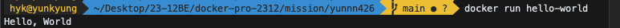

## 1. 컨테이너 기술이란 무엇입니까? (100자 이내로 요약)

컨테이너 기술은 호스트 운영체제의 커널을 공유하여 격리된 컴퓨팅 자원을 제공하는 가상화 기술이다. 부팅 속도가 매우 빠르며 메모리 사용량이 적다는 장점이 있다.

## 2. 도커란 무엇입니까? (100자 이내로 요약)

도커는 컨테이너 기반의 오픈소스 가상화 플랫폼으로, 리눅스 컨테이너를 만들고 사용할 수 있다. 이를 활용해 컨테이너 구축, 이미지 전송, 버전 관리 등을 용이하게 할 수 있다.

## 3. 도커 파일, 도커 이미지, 도커 컨테이너의 개념은 무엇이고, 서로 어떤 관계입니까?

- 도커 파일: 의존성 패키지 등 사용했던 설정 파일의 버전을 관리하기 쉽도록 명시
- 도커 이미지: 서비스 운영에 필요한 서버 프로그램, 소스코드 및 라이브러리, 컴파일된 실행 파일을 묶는 형태
- 도커 컨테이너: 이미지를 실행한 형태로 응용프로그램을 캡슐화하여 프로세스를 동작시키는 격리된 공간
  도커 파일을 이용해 이미지를 만들고 실행하면 도커 컨테이너가 된다.

## 4. [실전 미션] 도커 설치하기 (참조: 도커 공식 설치 페이지)

